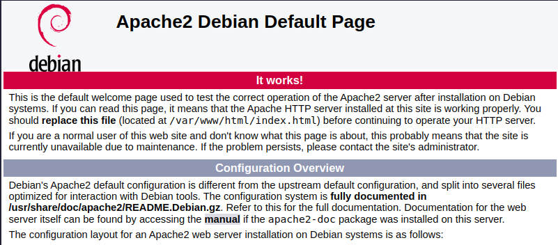

# Qwiklabs Assessment: Manage Websites With Apache2

## Learning Objectives

- Getting familiar with Apache2

- Configuring Apache2 on Linux

- Enabling and Disabling websites in Apache2

## Introduction

Managing web servers is one of the most common tasks done by systems administrators. The web server could be hosting an informational website, a content management system, or even a full blown e-commerce site. Whatever the content is, it's important to understand how to manage the web server that is being used to serve those pages.


## What you’ll do

In this lab, you will install Apache2, a widely used web server software.  You'll enable a site that is different from the default and enable additional features on the server.


## Linux commands reminder

In this lab, we'll use a number of Linux commands that were already explained during Course 3. Here is a reminder of these commands and their actions:

- ``sudo <command>``: executes a command with administrator rights
- ``apt update``: updates the list of available packages to be installed
- ``apt install package``: installs the given package in the system
- ``ls <directory>``: lists the files in a directory
- ``cp <old> <new>``: creates a copy of the old file with the new name
- ``mv <old> <new>``: moves or renames the old file to the new name
- ``nano <file>``: opens a text editor to edit the file
- ``cat <file>``: outputs the whole contents of a file


We will also be using the ``service`` command shown in a previous lab, and we will present a number of new commands like ``a2ensite`` or ``a2dismod``. Remember that you can always read the manual page using ``man <command_name>`` to learn more about a command.

While you can copy and paste the commands that are presented in this lab, we recommend typing them out manually, to help with understanding and remember them.

## The scenario
A web designer in your company has developed an institutional site that will let customers learn more about the company. It's now your job to deploy this site and make it available to the world.

The virtual machine that you are going to use for this lab will represent the test instance where you will test the provided website, verify that it works correctly, figure out which steps to follow and determine what the configuration should look like. In a real-life scenario, after completing the steps in this lab you would apply the same configuration to the production machine.

The developed website is currently inside the ``/opt/devel/ourcompany`` directory. Let's look at the contents of this directory:

```
ls -l /opt/devel/ourcompany
```
```
total 20
-rwxr-xr-x 1 student student 561 Jun 19 13:27 aboutus.html
-rwxr-xr-x 1 student student 551 Jun 19 13:27 contact.html
-rwxr-xr-x 1 student student  95 Jun 19 13:27 footer.html
-rwxr-xr-x 1 student student 596 Jun 19 13:27 index.html
-rw-r--r-- 1 student student 777 Jun 19 13:27 style.css
```

So, we have a bunch of HTML pages and a CSS stylesheet that form the website that we want to serve. Let's use these and get on with it.

## Installing Apache2

The machine that you are connected to does not yet have any web server running on it. Let's fix that by first updating the list of packages and then installing the ``Apache2`` package:

```
sudo apt update
sudo apt install apache2
```

This will show you a prompt with a list of packages that will be installed together with Apache2. These packages are known as the dependencies of the package. Press "y" at the prompt to continue with the installation.

```
Reading package lists... Done
Building dependency tree       
Reading state information... Done
The following additional packages will be installed:
  apache2-bin apache2-data apache2-utils libapr1 libaprutil1 libaprutil1-dbd-sqlite3 libaprutil1-ldap libbrotli1
  libjansson4 liblua5.2-0 ssl-cert
Suggested packages:
  apache2-doc apache2-suexec-pristine | apache2-suexec-custom www-browser openssl-blacklist
The following NEW packages will be installed:
  apache2 apache2-bin apache2-data apache2-utils libapr1 libaprutil1 libaprutil1-dbd-sqlite3 libaprutil1-ldap libbrotli1
  libjansson4 liblua5.2-0 ssl-cert
0 upgraded, 12 newly installed, 0 to remove and 23 not upgraded.
Need to get 2628 kB of archives.
After this operation, 8946 kB of additional disk space will be used.
Do you want to continue? [Y/n] y
```

As soon as it's installed. You will find the Apache2 web service isn't running.

```
sudo service apache2 status
```

```
apache2 is not running ... failed!
```

To start the Apache web service use the command below.

```
sudo service apache2 start
```

Apache2 will start serving its default webpage. To see this default web page, enter the ``External IP address`` that's shown in the connection panel, in a new separate browser tab.

You should see the default website there:



That's great, we already have a web server working and serving its default page. Additionally, that default page is giving us a lot of useful information regarding how to configure Apache2.